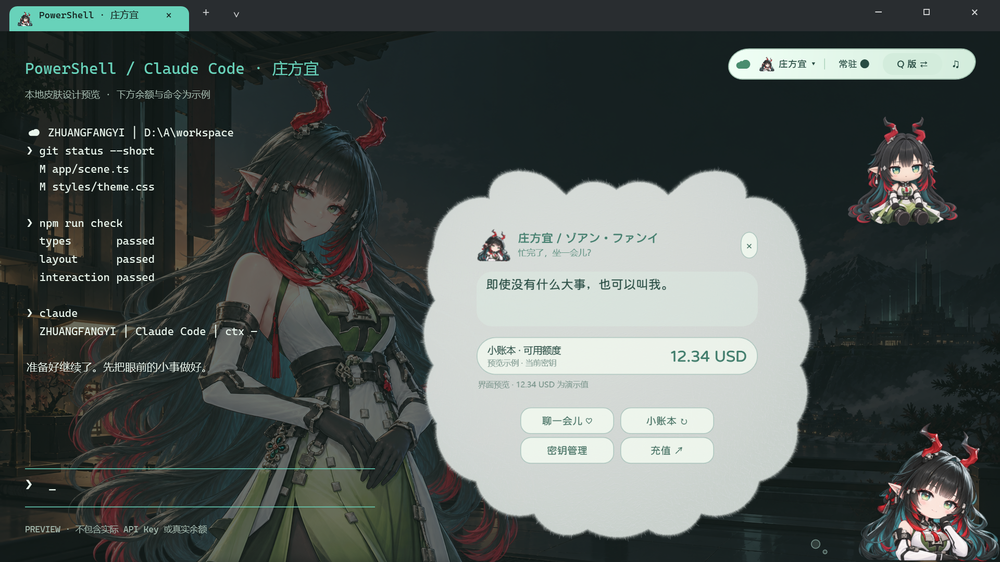

# OC Shell Skin Workflow

可复用的 Windows PowerShell / Claude Code CLI 角色皮肤工作流：从官方角色资料、图片制作和人设台词，到软绒气泡、桌宠交互、Qwen 语音克隆与本地烘焙，再到独立安装包和发布检查。

这是 [NAMELESSAurora/oc-shell-skin-workflow](https://github.com/NAMELESSAurora/oc-shell-skin-workflow) 的私有仓库。已有皮肤的制作经验整理为脚本、模板和源码，庄方宜作为经过验证的完整示例；下载成品无需先跑制作流程。

[下载完整发布附件](https://github.com/NAMELESSAurora/oc-shell-skin-workflow/releases/tag/v1.0.0) · [制作流程](docs/ART.md) · [人设与对白](docs/PERSONA.md) · [语音流程](docs/VOICE.md) · [原生接入](docs/RUNTIME.md)



预览中的余额和终端文字为静态示例；图用于版式和素材说明，不能作为实时余额或实时 GPU 渲染结果。

## 直接使用庄方宜完整皮肤

在 Release 下载庄方宜完整包 `ZhuangFangyi-Full-Skin-2026-10-04.zip` 及 `.sha256`，解压到长期保留的位置，先运行“校验文件.cmd”，再运行“安装皮肤.cmd”。安装后可在 Windows Terminal 选择 PowerShell 或 Claude 的庄方宜入口。发布附件采用 ASCII 文件名，避免 GitHub 自动改写中文下载名；包内中文文件名和说明保留。

完整包含坐姿娃娃、精致 Q 版和简 Bot、Q版/Bot 切换、4K 人物背景、青玉暖白软绒气泡、中文人设与对白、56 条本地日语触碰语音、字体、来源与提示词、预编译 EXE、安装启动脚本及可重新构建的源码。常驻/聚焦模式、窗口跟随、拖动摆放、捏压回弹、碰撞和边缘吸附沿用原生运行逻辑。

运行需要 Windows 10/11、Windows Terminal、Windows PowerShell 5.1 和系统 .NET Framework；Claude 模式需要已安装 Claude Code。离线互动语音不需要 API Key。联网聊天、余额、实时 TTS 和 CLI Key 管理通过本机设置使用自己的凭据；包内不带密钥、账户音色绑定或聊天记忆。

## 制作新的角色

制作端需要 Windows PowerShell 5.1、Python 3.12 和 Pillow。Three.js 气泡烘焙另需 Node.js 与 Playwright；超分另需本机 waifu2x-ncnn-vulkan；联网语音阶段另需自己的 Qwen 凭据与可用音色。它们是制作时依赖，成品运行不依赖 Python、Node 或浏览器。

```powershell
python -m pip install -r requirements.txt
./scripts/New-Character.ps1 -Id myrole -ProfileName MyRole -DisplayName '角色名' -Destination workspaces/myrole
```

这条命令建立**草稿骨架**，不会生成图片、语音或调用模型。之后依次完成：

1. **身份和画风**：整理官方资料、版本、眼色、服饰与参考来源。用 `templates/image-prompts.json` 分别制作娃娃、精致 Q 版、简 Bot、透明人物母图和环境层；审核完整头发、比例及实际 RGBA。
2. **背景和材质**：人物与环境分别超分，等比合成，边缘只做适当 alpha 过渡，保留主要人物细节。设计角色专属形状和内容安全区，烘焙 Three.js 软绒/果冻 PNG，验证整块有效形体的命中和拖动。
3. **人设与对话**：根据正典资料写自然中文个性、亲疏边界与场景响应；创作轻触、捏压、拖动、释放、碰撞等日语台词，避免每句同样开头、客服腔、急促抢话或过度气喘。
4. **语音**：保存来源、清理并试听参考音，使用自己的本地 Key 克隆和烘焙；通过整理器生成 WAV + SHA sidecar、相对路径 manifest 和试听页。默认运行优先播放本地音频；实时 TTS 为显式启用的可选管线。
5. **接入与发布**：补齐角色 contract 列出的资源，确认草稿已审查，再构建独立运行目录。检查图片、布局、语音、安装预览和实际交互，打包时使用文件清单与 SHA 校验。

图片生成提示词需要在支持参考图与透明输出的图像生成工具中执行；仓库记录制作指令与检查方法，不将脚本插值冒充生成或模型超分，也不会默认消耗云端额度。

## 编译和检查

只编译核心源码，不安装、不填 Key、不请求 API：

```powershell
./scripts/Build-Runtime.ps1
python -m unittest discover -s tests -v
python scripts/Scan-Privacy.py
```

用已解压的庄方宜完整包做资源注入和离线验证：

```powershell
./scripts/Build-Runtime.ps1 -AssetRoot './local/ZhuangFangyi-Full-Skin-20261004'
./scripts/Validate-Runtime.ps1 -RuntimeRoot './build/runtime/zhuangfangyi'
```

默认 `local`、`workspaces`、`build` 和 `dist` 不进 Git。只有源码编译成功时，报告明确标为素材未注入、GUI 未就绪；全量资源检查通过也不替代实际窗口交互与听感验收。具体参数和资源契约见 [RUNTIME.md](docs/RUNTIME.md)。

## 工具和目录

| 位置 | 用途 |
|---|---|
| `docs/ART.md` / `docs/PERSONA.md` | 图像、正典、自然对话、布局和人工验收流程 |
| `templates/` | 图像提示词、人设、台词、语音配置与角色运行契约 |
| `scripts/New-Character.ps1` | 生成独立角色草稿 |
| `scripts/Validate-Assets.py` | RGBA、尺寸、留白和批准 SHA 校验 |
| `scripts/Upscale-Layer.py` / [超分说明](docs/UPSCALING.md) | 可选本地 2× RGB 超分，独立还原人物 alpha |
| `scripts/Compose-Background.py` | 人物/环境等比合成、下沿渐变和文字区域暗化 |
| `materials/` / [材质说明](docs/MATERIALS.md) | Three.js r185 软绒/果冻 shader、形状示例和烘焙工具 |
| `scripts/Prepare-VoiceLibrary.py` / `scripts/Validate-VoiceLibrary.py` | 本地语音导出、台词一致性与 SHA 校验 |
| `runtime/` | Windows 原生桌宠、聊天、密钥管理、Qwen 与弹簧交互源码 |
| `scripts/Build-Runtime.ps1` / `scripts/Validate-Runtime.ps1` | 角色注册、资源注入、编译和离线契约验证 |
| `scripts/Package-Workflow.py` / `scripts/Verify-Archive.py` | 工作流源码 ZIP 和源码/皮肤 ZIP 校验 |
| `ci/validate.template.yml` | 离线工具测试、Windows 编译、Three.js 材质烘焙的 GitHub Actions 模板 |
| `examples/zhuangfangyi/` | 最终审核的有限示例；完整大图与语音在 Release |

## 复用时的边界

每个角色的形象、对白、语音方向和气泡形状需要单独设计；脚本提供可复用接入与验证，不能自动判断画风、服饰结构、人物神态或声音自然感。已验证的庄方宜素材是完整成品，新角色的 TODO 模板是草稿。

本地 Key 与音色绑定属于自己的运行配置；发布包保留来源与字体许可，不复制个人记录。代码和第三方角色素材的权利范围分别记录，见 [NOTICE.md](NOTICE.md) 和 [来源说明](docs/SOURCES-AND-RIGHTS.md)。

源码包的整理、校验、文件清单和发布操作见 [PACKAGING.md](docs/PACKAGING.md)。当前 GitHub 登录令牌没有写入 Actions 工作流所需的 `workflow` 权限，因此自动检查配置保留为 `ci/validate.template.yml`，尚未启用；本次构建与测试已在本地执行。具备该权限后，把模板放到 `.github/workflows/validate.yml` 即可启用相同检查。
